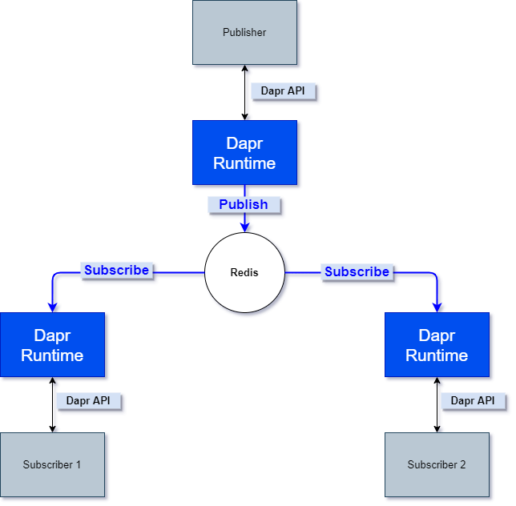

# Dapr Pub-Sub with .NET Core Sample (without using [Dapr Dotnet-SDK](https://github.com/dapr/dotnet-sdk))

This sample includes 3 .NET Core WebApi as below:

- 1 publisher
  - `Example.Dapr.Publisher`
- 2 subcribers:
  - `Example.Dapr.FirstSubscriber` will subscribe on **ProductCreated** topic
  - `Example.Dapr.SecondSubscriber` will subscribe on **ProductCreated** topic



## Prerequisites

1. Install Docker for Desktop
2. Install [Dapr Cli](https://github.com/dapr/docs/blob/master/getting-started/environment-setup.md)

## Run projects with Dapr Cli

1. Starting **Publisher**

    ```powershell
    cd .\source\Example.Dapr.Publisher\
    ```

    ```powershell
    dapr run --app-id example-publisher --app-port 5000 dotnet run
    ```

2. Starting **FirstSubscriber**

    ```powershell
    cd .\source\Example.Dapr.FirstSubscriber\
    ```

    ```powershell
    dapr run --app-id example-first-subscriber --app-port 5001 dotnet run
    ```

3. Starting **SecondSubscriber**

    ```powershell
    cd .\source\Example.Dapr.SecondSubscriber\
    ```

    ```powershell
    dapr run --app-id example-second-subscriber --app-port 5002 dotnet run
    ```

## Use the CLI to Publish Messages to Subscribers

```powershell
dapr publish --topic ProductCreated --payload "{ \"ProductId\": 1, \"Code\":\"this-is-a-test\" }"
```

Both subscribers which are **example-first-subscriber** & **example-second-subscriber** receive a message

```cmd
== APP == [13:02:37 INF] Request starting HTTP/1.1 POST http://127.0.0.1:5001/ProductCreated application/cloudevents+json 220

== APP == [13:02:37 INF] Executing endpoint 'Example.Dapr.FirstSubscriber.Controllers.SubscriberController.SubscribeProductCreated (Example.Dapr.FirstSubscriber)'

== APP == [13:02:37 INF] Route matched with {action = "SubscribeProductCreated", controller = "Subscriber"}. Executing controller action with signature Microsoft.AspNetCore.Mvc.IActionResult SubscribeProductCreated(System.Object) on controller Example.Dapr.FirstSubscriber.Controllers.SubscriberController (Example.Dapr.FirstSubscriber).

== APP == [13:02:37 INF] [SubscriberController]: Received request from publisher: {"id":"d00c95b3-3b28-4da6-85c1-ec5563bffb21","source":"example-publisher","type":"com.dapr.event.sent","specversion":"0.3","datacontenttype":"application/json","data":{"ProductId":1,"Code":"this-is-a-test"},"subject":""}

== APP == [13:02:37 INF] Executing HttpStatusCodeResult, setting HTTP status code 200

== APP == [13:02:37 INF] Executed action Example.Dapr.FirstSubscriber.Controllers.SubscriberController.SubscribeProductCreated (Example.Dapr.FirstSubscriber) in 19.6132ms

== APP == [13:02:37 INF] Executed endpoint 'Example.Dapr.FirstSubscriber.Controllers.SubscriberController.SubscribeProductCreated (Example.Dapr.FirstSubscriber)'

== APP == [13:02:37 INF] Request finished in 63.5069ms 200
```

```cmd
== APP == [13:02:37 INF] Request starting HTTP/1.1 POST http://127.0.0.1:5002/ProductCreated application/cloudevents+json 220

== APP == [13:02:37 INF] Executing endpoint 'Example.Dapr.SecondSubscriber.Controllers.SubscriberController.SubscribeProductCreated (Example.Dapr.SecondSubscriber)'

== APP == [13:02:37 INF] Route matched with {action = "SubscribeProductCreated", controller = "Subscriber"}. Executing controller action with signature Microsoft.AspNetCore.Mvc.IActionResult SubscribeProductCreated(System.Object) on controller Example.Dapr.SecondSubscriber.Controllers.SubscriberController (Example.Dapr.SecondSubscriber).

== APP == [13:02:37 INF] [SubscriberController]: Received request from publisher: {"id":"d00c95b3-3b28-4da6-85c1-ec5563bffb21","source":"example-publisher","type":"com.dapr.event.sent","specversion":"0.3","datacontenttype":"application/json","data":{"ProductId":1,"Code":"this-is-a-test"},"subject":""}

== APP == [13:02:37 INF] Executing HttpStatusCodeResult, setting HTTP status code 200

== APP == [13:02:37 INF] Executed action Example.Dapr.SecondSubscriber.Controllers.SubscriberController.SubscribeProductCreated (Example.Dapr.SecondSubscriber) in 25.8006ms

== APP == [13:02:37 INF] Executed endpoint 'Example.Dapr.SecondSubscriber.Controllers.SubscriberController.SubscribeProductCreated (Example.Dapr.SecondSubscriber)'

== APP == [13:02:37 INF] Request finished in 68.4881ms 200
```

## Use Visual Studio Code and RestClient extension to publish the message

- [RestClient extension](https://marketplace.visualstudio.com/items?itemName=humao.rest-client) must be installed within Visual Studio Code
- Open [vscode-rest-test\create-product.http](vscode-rest-test/create-product.http) by Visual Studio Code; then click on **Send Request** and observe the log


## Notes

### For Subscribers

- Since we subscribe on **ProductCreated** topic, hence we have to define the endpoint as below

```csharp
[HttpPost("ProductCreated")]
public IActionResult SubscribeProductCreated(object request)
```

- Then expose to Dapr runtime by define the **MapGet** inside **Startup.cs**

```csharp
app.UseEndpoints(endpoints =>
{
    endpoints.MapControllers();
    endpoints.MapGet("/dapr/subscribe", async context =>
    {
        var channels = new[] { "ProductCreated" };
        var toJson = JsonSerializer.Serialize(channels);
        context.Response.ContentType = "application/json";
        await context.Response.WriteAsync(toJson);
    });
});
```

### For Publisher

- First, we define the `DaprPublisher` as Http Client in `Startup.cs`

```csharp
services
    .AddHttpClient<DaprPublisher>((provider, client) =>
    {
        var logger = provider.GetRequiredService<ILogger<Startup>>();

        var baseAddress = $"http://localhost:{Environment.GetEnvironmentVariable("DAPR_HTTP_PORT")}";

        logger.LogInformation($"[{nameof(Startup)}] - Publish Address: {baseAddress}");

        client.BaseAddress = new Uri(baseAddress, UriKind.Absolute);
    });
```

- Then, in order to publish the message to **ProductCreated** topic, we just simply make a POST request to `http://localhost:{DAPR_HTTP_PORT}/v1.0/publish/ProductCreated`. See the code at [DaprPublisher.cs](/source/Example.Dapr.Publisher/Publisher/DaprPublisher.cs)

## Give a Star! :star:

If you liked this project or if it helped you, please give a star :star: for this repository. Thank you!!!

## Resources

1. [Concepts of Publish/Subscribe Messaging](https://github.com/dapr/docs/tree/master/concepts/publish-subscribe-messaging)
2. [Configure Redis](https://github.com/dapr/docs/tree/master/howto/configure-redis)
3. [Publish Topic](https://github.com/dapr/docs/tree/master/howto/publish-topic)
4. [Consume Topic](https://github.com/dapr/docs/tree/master/howto/consume-topic)
5. [Examples](https://github.com/dapr/samples/tree/master/4.pub-sub)